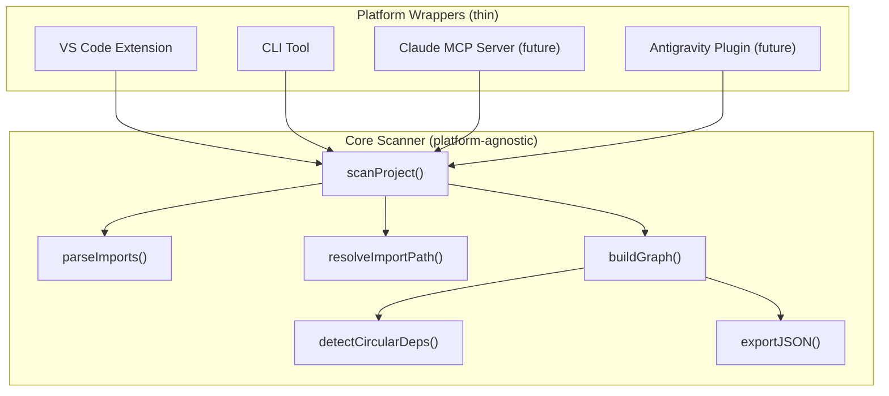
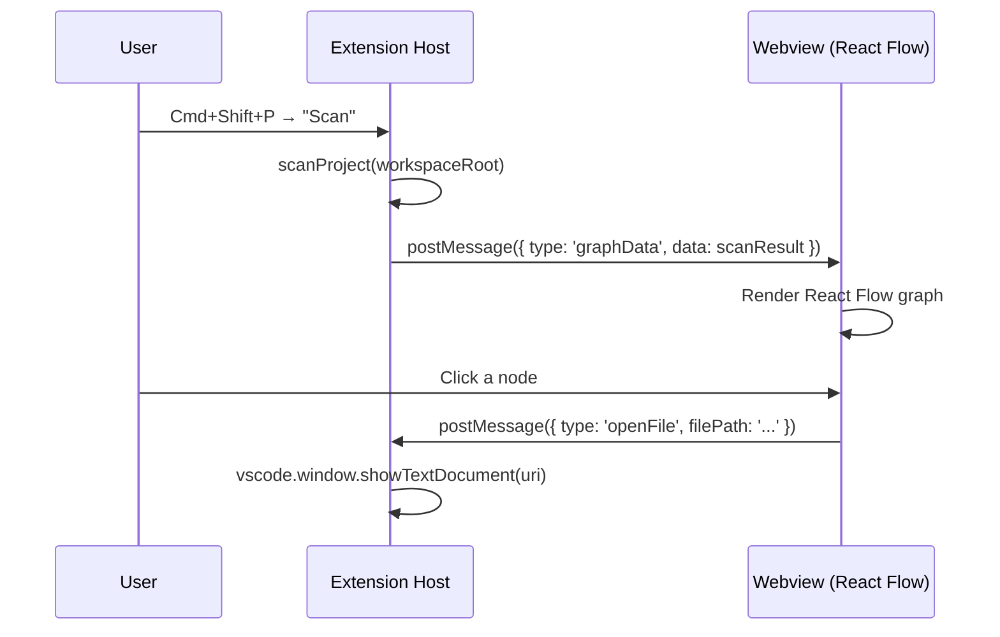

# React Dependency Graph — Development Plan

## 1. Architecture Overview

The project follows a **layered architecture** with a platform-agnostic core and thin platform-specific wrappers:



> [!IMPORTANT]
> The core package has **zero dependencies** on VS Code, CLI frameworks, or any platform-specific API. It is a pure TypeScript library that takes a directory path and returns a dependency graph.

---

## 2. Monorepo Folder Structure

```
react-dependency-graph/
├── package.json                      # Root workspace config
├── tsconfig.base.json                # Shared TypeScript config
├── turbo.json                        # Turborepo pipeline (optional)
├── .gitignore
├── .eslintrc.json
├── README.md
├── DEVELOPMENT_PLAN.md               # This plan (copy for reference)
│
├── packages/
│   ├── core/                         # @rdg/core — platform-agnostic scanner
│   │   ├── package.json
│   │   ├── tsconfig.json
│   │   ├── vitest.config.ts
│   │   └── src/
│   │       ├── index.ts              # Public API barrel export
│   │       ├── types.ts              # All shared TypeScript types
│   │       ├── scanProject.ts        # Main entry: scan a project directory
│   │       ├── parseImports.ts       # Parse import statements from a file
│   │       ├── resolveImports.ts     # Resolve relative/alias import paths
│   │       ├── buildGraph.ts         # Construct the dependency graph
│   │       ├── detectCircularDeps.ts # Circular dependency detection (DFS)
│   │       ├── configLoader.ts       # Load tsconfig/jsconfig path aliases
│   │       ├── fileDiscovery.ts      # Walk filesystem, respect ignore patterns
│   │       └── exportGraph.ts        # Serialize graph to JSON
│   │
│   ├── cli/                          # @rdg/cli — CLI wrapper
│   │   ├── package.json
│   │   ├── tsconfig.json
│   │   └── src/
│   │       ├── index.ts              # Entry point with shebang
│   │       ├── commands/
│   │       │   ├── scan.ts           # `scan` command handler
│   │       │   └── inspect.ts        # `inspect <file>` command (future)
│   │       └── formatters/
│   │           ├── json.ts           # JSON output formatter
│   │           ├── text.ts           # Human-readable text output
│   │           └── dot.ts            # Graphviz DOT format (future)
│   │
│   └── vscode-extension/            # react-dependency-graph (VS Code ext)
│       ├── package.json              # Also the VS Code extension manifest
│       ├── tsconfig.json
│       ├── .vscodeignore
│       ├── src/
│       │   ├── extension.ts          # activate() / deactivate()
│       │   ├── commands.ts           # Register VS Code commands
│       │   ├── treeView/
│       │   │   ├── DependencyTreeProvider.ts
│       │   │   └── DependencyTreeItem.ts
│       │   ├── webview/
│       │   │   ├── WebviewPanel.ts   # Create/manage the webview panel
│       │   │   └── messageHandler.ts # Handle webview ↔ extension messages
│       │   └── utils/
│       │       └── openFile.ts       # Open file in editor from graph click
│       └── webview-ui/               # React app for the webview
│           ├── package.json
│           ├── vite.config.ts
│           ├── index.html
│           └── src/
│               ├── App.tsx
│               ├── components/
│               │   └── DependencyGraph.tsx  # React Flow graph component
│               └── hooks/
│                   └── useVSCodeAPI.ts      # Communication with extension
```

---

## 3. Code Ownership by Package

### Core Package (`@rdg/core`)

| Module | Responsibility |
|--------|---------------|
| `types.ts` | All shared interfaces: `GraphNode`, `GraphEdge`, `DependencyGraph`, `ScanOptions`, `ScanResult` |
| `fileDiscovery.ts` | Walk directory tree, filter by extensions, respect ignore patterns |
| `parseImports.ts` | Use `@babel/parser` + `@babel/traverse` to extract import specifiers from AST |
| `resolveImports.ts` | Resolve relative paths, handle `index.js` conventions, apply tsconfig aliases |
| `configLoader.ts` | Read `tsconfig.json` / `jsconfig.json`, parse `compilerOptions.paths` and `baseUrl` |
| `buildGraph.ts` | Build adjacency list from parsed imports, create `GraphNode[]` and `GraphEdge[]` |
| `detectCircularDeps.ts` | DFS-based cycle detection, return all circular dependency chains |
| `scanProject.ts` | Orchestrator: calls fileDiscovery → parseImports → resolveImports → buildGraph |
| `exportGraph.ts` | Serialize `DependencyGraph` to JSON (with metadata like timestamp, project root) |

### CLI Package (`@rdg/cli`)

| Module | Responsibility |
|--------|---------------|
| `index.ts` | Parse CLI arguments (using `commander`), dispatch to command handlers |
| `commands/scan.ts` | Call `@rdg/core`'s `scanProject()`, format and output result |
| `formatters/*.ts` | Transform `ScanResult` into various output formats |

### VS Code Extension

| Module | Responsibility |
|--------|---------------|
| `extension.ts` | `activate()` / `deactivate()` lifecycle — register commands, tree views, webview |
| `commands.ts` | Bind VS Code command palette entries to core scanner actions |
| `treeView/` | Implement `TreeDataProvider` to show dependency tree in sidebar |
| `webview/` | Create webview panel, load React Flow UI, handle bidirectional messaging |
| `webview-ui/` | Standalone React app: renders `ReactFlow` graph, posts messages to extension host |

---

## 4. Data Structures

```typescript
// ─── Core Types ──────────────────────────────────────────

/** A single file node in the dependency graph */
export interface GraphNode {
  /** Unique ID — the absolute file path */
  id: string;
  /** Path relative to project root (for display) */
  relativePath: string;
  /** File extension: .ts, .tsx, .js, .jsx */
  extension: string;
  /** Number of files that import this file */
  inDegree: number;
  /** Number of files this file imports */
  outDegree: number;
  /** Whether this file is part of a circular dependency */
  isCircular: boolean;
  /** Optional: detected component name (from default export) */
  componentName?: string;
}

/** A directed edge: source imports target */
export interface GraphEdge {
  /** Absolute path of the importing file */
  source: string;
  /** Absolute path of the imported file */
  target: string;
  /** The original import specifier as written in code */
  importSpecifier: string;
  /** Named imports: ['useState', 'useEffect'] */
  importedNames: string[];
  /** Whether this is a type-only import */
  isTypeOnly: boolean;
}

/** The full dependency graph */
export interface DependencyGraph {
  /** Project root directory */
  rootDir: string;
  /** All file nodes */
  nodes: GraphNode[];
  /** All import edges */
  edges: GraphEdge[];
  /** Detected circular dependency chains */
  circularDependencies: CircularChain[];
  /** Scan metadata */
  metadata: ScanMetadata;
}

/** A circular dependency chain */
export interface CircularChain {
  /** Ordered list of file paths forming the cycle */
  chain: string[];
  /** Human-readable description */
  description: string;
}

/** Scan configuration */
export interface ScanOptions {
  /** Project root directory to scan */
  rootDir: string;
  /** File extensions to include (default: ['.js', '.jsx', '.ts', '.tsx']) */
  extensions?: string[];
  /** Additional directories/patterns to ignore */
  ignorePatterns?: string[];
  /** Whether to detect circular dependencies (default: true) */
  detectCircular?: boolean;
  /** Whether to resolve path aliases from tsconfig (default: true) */
  resolveAliases?: boolean;
  /** Max depth for directory traversal (default: Infinity) */
  maxDepth?: number;
}

/** Result returned by scanProject() */
export interface ScanResult {
  graph: DependencyGraph;
  /** Total files scanned */
  totalFiles: number;
  /** Total import edges found */
  totalImports: number;
  /** Files that could not be parsed (with error reasons) */
  errors: ScanError[];
  /** Scan duration in milliseconds */
  durationMs: number;
}

export interface ScanError {
  filePath: string;
  error: string;
}

export interface ScanMetadata {
  scannedAt: string;         // ISO 8601 timestamp
  scanDurationMs: number;
  projectRoot: string;
  totalFiles: number;
  totalEdges: number;
  circularCount: number;
  rdgVersion: string;
}
```

---

## 5. MVP Roadmap

### v0.1 — Core Scanner (Foundation)

**Goal**: Parse imports and build a dependency graph from a React project directory.

| Task | Details |
|------|---------|
| Define all types in `types.ts` | `GraphNode`, `GraphEdge`, `DependencyGraph`, `ScanOptions`, `ScanResult` |
| Implement `fileDiscovery.ts` | Recursive directory walk with `fs.readdir`/`fs.stat`, ignore `node_modules`, `dist`, `build`, `.next`, `coverage`, `.git` |
| Implement `parseImports.ts` | Use `@babel/parser` with `typescript`, `jsx`, `decorators` plugins. Use `@babel/traverse` to visit `ImportDeclaration`, `ExportNamedDeclaration` (re-exports), and `CallExpression` for `require()` |
| Implement `resolveImports.ts` | Resolve relative paths (`.`, `..`), try extensions (`.ts`, `.tsx`, `.js`, `.jsx`), try `/index.*` |
| Implement `configLoader.ts` | Parse `tsconfig.json`/`jsconfig.json`, extract `baseUrl` + `paths`, build alias resolver |
| Implement `buildGraph.ts` | Construct nodes and edges, calculate `inDegree`/`outDegree` |
| Implement `scanProject.ts` | Orchestrate full pipeline |
| Implement `exportGraph.ts` | JSON serialization with metadata |
| Write unit tests | Test each module independently with vitest |

**Deliverable**: `scanProject('/path/to/react-app')` returns a `ScanResult` with full graph data.

---

### v0.2 — CLI Tool

**Goal**: Make the scanner usable from the terminal (and by AI agents).

| Task | Details |
|------|---------|
| Set up `commander` CLI framework | Define `scan` command with options |
| Implement `--format` flag | `json` (default), `text` (human-readable summary) |
| Implement `--output` flag | Write to file instead of stdout |
| Implement `--entry` flag | Optional: scan from a specific entry file |
| Implement `--ignore` flag | Additional ignore patterns |
| Add `npx` support | Set `bin` field in `package.json` |
| Write integration tests | Test CLI output formats |

**Deliverable**: `npx react-dependency-graph scan --format json > deps.json`

---

### v0.3 — VS Code Extension (Commands)

**Goal**: Basic VS Code extension that runs the scanner via command palette.

| Task | Details |
|------|---------|
| Scaffold VS Code extension | Use `yo code` or manual setup |
| Register commands | `rdg.scan` — scan current workspace |
| Show results | Output channel or information message with summary |
| Status bar | Show scanning progress |

**Deliverable**: Open VS Code → Cmd+Shift+P → "React Dependency Graph: Scan" → see results.

---

### v0.4 — Tree View

**Goal**: Show the dependency tree in VS Code sidebar.

| Task | Details |
|------|---------|
| Implement `TreeDataProvider` | Display files as a tree, grouped by directory |
| Show import count | Badge showing in/out degree |
| Click to open file | `vscode.window.showTextDocument()` |
| Refresh on file save | Watch for file changes |
| Filter/search | Allow filtering the tree |

**Deliverable**: Sidebar panel showing dependency tree with file navigation.

---

### v0.5 — Webview Graph

**Goal**: Interactive graph visualization using React Flow.

| Task | Details |
|------|---------|
| Create React app for webview | Vite + React + React Flow |
| Build webview panel manager | Load compiled React app into webview |
| Implement message passing | Extension ↔ Webview via `postMessage` |
| Graph layout | Use dagre or elkjs for automatic layout |
| Node click → open file | Post message to extension, extension opens file |
| Styling | Color-code by file type, highlight circular deps |
| Zoom/pan controls | React Flow built-in controls |

**Deliverable**: Beautiful interactive graph in VS Code with click-to-navigate.

---

### v0.6 — Circular Dependency Detection

**Goal**: Detect and highlight circular dependencies.

| Task | Details |
|------|---------|
| Implement DFS cycle detection | Tarjan's algorithm or simple DFS with coloring |
| Highlight in tree view | Warning icon on circular files |
| Highlight in graph | Red edges for circular imports |
| Diagnostics | VS Code problem panel warnings |
| CLI warning output | Print circular chains to stderr |

**Deliverable**: Circular deps detected, highlighted in all views, with actionable warnings.

---

### v1.0 — Polished Release

| Task | Details |
|------|---------|
| Polish UI | Consistent icons, colors, animations |
| Performance | Handle 1000+ file projects efficiently |
| Configuration | `.rdgrc.json` config file support |
| Documentation | README, contributing guide, API docs |
| Publish CLI to npm | `npm publish` with proper scope |
| Publish VS Code extension | Package `.vsix`, publish to marketplace |
| CI/CD | GitHub Actions for testing, building, publishing |

---

## 6. How to Parse React/TypeScript Imports

### Parser Setup

```typescript
import { parse } from '@babel/parser';
import traverse from '@babel/traverse';

function parseFile(code: string, filePath: string) {
  const ast = parse(code, {
    sourceType: 'module',
    plugins: [
      'typescript',        // Handle .ts/.tsx
      'jsx',               // Handle JSX in .tsx/.jsx
      'decorators-legacy', // Handle decorators (@Component, etc.)
      'dynamicImport',     // Handle import() expressions
      'classProperties',   // Handle class fields
      'optionalChaining',  // Handle ?. syntax
      'nullishCoalescingOperator',
    ],
  });

  const imports: ImportInfo[] = [];

  traverse(ast, {
    // Static imports: import X from './Y'
    ImportDeclaration(path) {
      imports.push({
        source: path.node.source.value,
        specifiers: path.node.specifiers.map(s => s.local.name),
        isTypeOnly: path.node.importKind === 'type',
      });
    },

    // Re-exports: export { X } from './Y'
    ExportNamedDeclaration(path) {
      if (path.node.source) {
        imports.push({
          source: path.node.source.value,
          specifiers: [],
          isTypeOnly: path.node.exportKind === 'type',
        });
      }
    },

    // export * from './Y'
    ExportAllDeclaration(path) {
      imports.push({
        source: path.node.source.value,
        specifiers: ['*'],
        isTypeOnly: false,
      });
    },

    // Dynamic imports: const X = await import('./Y')
    CallExpression(path) {
      if (path.node.callee.type === 'Import' &&
          path.node.arguments[0]?.type === 'StringLiteral') {
        imports.push({
          source: path.node.arguments[0].value,
          specifiers: [],
          isDynamic: true,
          isTypeOnly: false,
        });
      }
    },

    // require(): const X = require('./Y')
    CallExpression(path) {
      if (path.node.callee.type === 'Identifier' &&
          path.node.callee.name === 'require' &&
          path.node.arguments[0]?.type === 'StringLiteral') {
        imports.push({
          source: path.node.arguments[0].value,
          specifiers: [],
          isTypeOnly: false,
        });
      }
    },
  });

  return imports;
}
```

### What Gets Detected

| Import Style | Detected? |
|---|---|
| `import React from 'react'` | ✅ Yes (but skipped — external package) |
| `import { useState } from 'react'` | ✅ Yes (skipped — external) |
| `import Button from './Button'` | ✅ Yes — relative import |
| `import { helper } from '../utils/helper'` | ✅ Yes — relative import |
| `import type { Props } from './types'` | ✅ Yes — marked as `isTypeOnly` |
| `export { default } from './Button'` | ✅ Yes — re-export |
| `export * from './utils'` | ✅ Yes — barrel re-export |
| `const X = await import('./lazy')` | ✅ Yes — dynamic import |
| `const X = require('./legacy')` | ✅ Yes — CommonJS require |
| `import styles from './Button.module.css'` | ✅ Yes — tracked as asset import |
| `import '@/components/Button'` | ✅ Yes — alias resolved via tsconfig |

---

## 7. How to Resolve Import Paths

### Resolution Algorithm

```
resolveImport(importSpecifier, importingFile, projectRoot, aliases):
  1. If specifier starts with '.' or '..':
     → Resolve relative to importing file's directory
     → Try exact match first
     → Try appending extensions: .ts, .tsx, .js, .jsx
     → Try appending /index.ts, /index.tsx, /index.js, /index.jsx
     → Return resolved path or null

  2. If specifier matches an alias pattern (e.g., '@/'):
     → Replace alias prefix with mapped path
     → Resolve as relative path (step 1)

  3. If specifier doesn't start with '.' and isn't an alias:
     → It's an external package (react, lodash, etc.)
     → Skip — don't include in dependency graph

  4. Return null if unresolvable (log as warning)
```

### Extension Resolution Order

When a file imports `./Button`, the resolver tries:
1. `./Button.ts`
2. `./Button.tsx`
3. `./Button.js`
4. `./Button.jsx`
5. `./Button/index.ts`
6. `./Button/index.tsx`
7. `./Button/index.js`
8. `./Button/index.jsx`

---

## 8. How to Handle Path Aliases (tsconfig.json)

### Loading Aliases

```typescript
// configLoader.ts
import * as path from 'path';
import * as fs from 'fs';

interface AliasMapping {
  prefix: string;    // e.g., '@/*' → '@/'
  paths: string[];   // e.g., ['./src/*'] → ['./src/']
}

function loadAliases(rootDir: string): AliasMapping[] {
  // Try tsconfig.json first, then jsconfig.json
  const configPaths = [
    path.join(rootDir, 'tsconfig.json'),
    path.join(rootDir, 'jsconfig.json'),
  ];

  for (const configPath of configPaths) {
    if (!fs.existsSync(configPath)) continue;

    const config = JSON.parse(fs.readFileSync(configPath, 'utf-8'));
    const { baseUrl = '.', paths = {} } = config.compilerOptions || {};
    const absoluteBaseUrl = path.resolve(rootDir, baseUrl);

    return Object.entries(paths).map(([pattern, targets]) => ({
      prefix: pattern.replace('*', ''),
      paths: (targets as string[]).map(t =>
        path.resolve(absoluteBaseUrl, t.replace('*', ''))
      ),
    }));
  }

  return [];
}
```

### Common tsconfig.json Patterns

| tsconfig `paths` | Import | Resolves to |
|---|---|---|
| `"@/*": ["./src/*"]` | `import X from '@/components/Button'` | `<root>/src/components/Button.tsx` |
| `"@components/*": ["./src/components/*"]` | `import X from '@components/Button'` | `<root>/src/components/Button.tsx` |
| `"~/*": ["./src/*"]` | `import X from '~/utils/helpers'` | `<root>/src/utils/helpers.ts` |

---

## 9. Ignore Patterns

### Default Ignored Directories

```typescript
const DEFAULT_IGNORE_PATTERNS = [
  'node_modules',
  'dist',
  'build',
  '.next',
  'coverage',
  '.git',
  '.cache',
  '.turbo',
  '__tests__',      // Optionally include tests
  '*.test.*',       // Test files
  '*.spec.*',       // Spec files
  '*.stories.*',    // Storybook files
  '*.d.ts',         // Declaration files
];
```

### Implementation Strategy

- Use `fast-glob` or manual recursive walk with early filtering
- Check directory names during traversal (prune entire subtrees)
- Support user-provided patterns via `ScanOptions.ignorePatterns`
- Support `.rdgignore` file (like `.gitignore` syntax) in future versions

---

## 10. VS Code Extension ↔ Webview Communication

### Architecture



### Message Protocol

```typescript
// Extension → Webview messages
type ExtensionMessage =
  | { type: 'graphData'; data: ScanResult }
  | { type: 'scanProgress'; progress: number; message: string }
  | { type: 'error'; message: string }
  | { type: 'highlightNode'; nodeId: string }
  | { type: 'theme'; isDark: boolean };

// Webview → Extension messages
type WebviewMessage =
  | { type: 'openFile'; filePath: string; line?: number }
  | { type: 'requestScan' }
  | { type: 'exportGraph'; format: 'json' | 'png' }
  | { type: 'ready' };  // Webview loaded and ready
```

### Extension Side (sending data to webview)

```typescript
// WebviewPanel.ts
panel.webview.postMessage({
  type: 'graphData',
  data: scanResult,
});
```

### Extension Side (receiving messages from webview)

```typescript
panel.webview.onDidReceiveMessage(async (message: WebviewMessage) => {
  switch (message.type) {
    case 'openFile':
      const uri = vscode.Uri.file(message.filePath);
      await vscode.window.showTextDocument(uri);
      break;
    case 'requestScan':
      const result = await scanProject(workspaceRoot);
      panel.webview.postMessage({ type: 'graphData', data: result });
      break;
    case 'exportGraph':
      // Save graph to file
      break;
  }
});
```

### Webview Side (React)

```typescript
// useVSCodeAPI.ts
const vscode = acquireVsCodeApi();

// Send message to extension
function openFile(filePath: string) {
  vscode.postMessage({ type: 'openFile', filePath });
}

// Receive messages from extension
window.addEventListener('message', (event) => {
  const message = event.data;
  if (message.type === 'graphData') {
    setGraphData(message.data);
  }
});
```

---

## 11. Opening Files from Graph Nodes

When a user clicks a node in the React Flow graph:

1. **Webview**: React Flow `onNodeClick` fires
2. **Webview**: Posts message `{ type: 'openFile', filePath: node.data.absolutePath }`
3. **Extension**: Receives message, calls `vscode.window.showTextDocument(vscode.Uri.file(filePath))`
4. **VS Code**: Opens the file in the editor, focuses the tab

```typescript
// In the extension's message handler:
case 'openFile': {
  const doc = await vscode.workspace.openTextDocument(
    vscode.Uri.file(message.filePath)
  );
  await vscode.window.showTextDocument(doc, {
    viewColumn: vscode.ViewColumn.One,  // Open in main editor
    preserveFocus: false,                // Focus the opened file
  });
  break;
}
```

---

## 12. Exporting Graph JSON

### JSON Output Format

```json
{
  "version": "1.0.0",
  "metadata": {
    "scannedAt": "2026-05-30T05:24:00.000Z",
    "scanDurationMs": 1234,
    "projectRoot": "/path/to/project",
    "totalFiles": 42,
    "totalEdges": 87,
    "circularCount": 2,
    "rdgVersion": "0.1.0"
  },
  "nodes": [
    {
      "id": "/path/to/project/src/App.tsx",
      "relativePath": "src/App.tsx",
      "extension": ".tsx",
      "inDegree": 1,
      "outDegree": 5,
      "isCircular": false
    }
  ],
  "edges": [
    {
      "source": "src/App.tsx",
      "target": "src/components/Header.tsx",
      "importSpecifier": "./components/Header",
      "importedNames": ["Header"],
      "isTypeOnly": false
    }
  ],
  "circularDependencies": [
    {
      "chain": ["src/A.tsx", "src/B.tsx", "src/A.tsx"],
      "description": "A.tsx → B.tsx → A.tsx"
    }
  ]
}
```

### Export Methods

| Method | How |
|---|---|
| **CLI** | `npx react-dependency-graph scan --format json > graph.json` |
| **CLI (--output)** | `npx react-dependency-graph scan --output graph.json` |
| **VS Code Command** | Cmd+Shift+P → "RDG: Export Graph JSON" → save dialog |
| **Webview Button** | Click export button → triggers save dialog via extension |
| **Programmatic** | `import { exportGraphJSON } from '@rdg/core'` |

---

## 13. Testing Strategy

### Testing the Core Scanner (Separately from VS Code)

```
packages/core/
├── src/
│   └── ...
├── __tests__/
│   ├── fixtures/              # Fake React projects for testing
│   │   ├── simple-project/
│   │   │   ├── src/
│   │   │   │   ├── App.tsx
│   │   │   │   ├── Button.tsx
│   │   │   │   └── utils.ts
│   │   │   └── tsconfig.json
│   │   ├── circular-project/  # Has circular deps
│   │   └── alias-project/     # Has tsconfig path aliases
│   ├── parseImports.test.ts
│   ├── resolveImports.test.ts
│   ├── buildGraph.test.ts
│   ├── detectCircularDeps.test.ts
│   ├── configLoader.test.ts
│   └── scanProject.test.ts    # Integration tests
```

**Test runner**: Vitest (fast, TypeScript-native, compatible with Jest API)

```bash
# Run core tests only
cd packages/core && npx vitest

# Run all tests from root
npx turbo test
```

**Key test cases**:
- Parse all import styles (static, dynamic, require, re-exports, type-only)
- Resolve relative imports with various extension combinations
- Resolve tsconfig path aliases
- Detect circular dependencies correctly
- Handle malformed files gracefully (don't crash)
- Ignore `node_modules` and other excluded directories
- Handle large projects without memory issues

### Testing the CLI

- Use `execa` or `child_process` to run CLI commands in tests
- Assert JSON output matches expected structure
- Test error cases (invalid directory, no React files)

### Testing the VS Code Extension

| Approach | What It Tests |
|---|---|
| **Unit tests** | Command handlers, tree data provider logic (mock VS Code API) |
| **Integration tests** | Use `@vscode/test-electron` to run in a real VS Code instance |
| **Manual testing** | Press F5 in VS Code to launch Extension Development Host |

```bash
# Test VS Code extension
cd packages/vscode-extension
npx vscode-test  # Runs in headless VS Code
```

---

## 14. Packaging the VS Code Extension

### Steps to Create .vsix

```bash
# 1. Install vsce (VS Code Extension CLI)
npm install -g @vscode/vsce

# 2. Build the extension
cd packages/vscode-extension
npm run build         # Compile TypeScript
npm run build:webview  # Build React webview app

# 3. Package as .vsix
vsce package --no-dependencies
# Output: react-dependency-graph-0.1.0.vsix

# 4. Install locally for testing
code --install-extension react-dependency-graph-0.1.0.vsix

# 5. Publish to marketplace (when ready)
vsce publish
```

### Extension Manifest (package.json key fields)

```json
{
  "name": "react-dependency-graph",
  "displayName": "React Dependency Graph",
  "publisher": "your-publisher-id",
  "engines": { "vscode": "^1.85.0" },
  "categories": ["Visualization", "Other"],
  "activationEvents": ["onCommand:rdg.scan"],
  "main": "./dist/extension.js",
  "contributes": {
    "commands": [
      { "command": "rdg.scan", "title": "Scan Dependencies", "category": "React Dependency Graph" },
      { "command": "rdg.exportJson", "title": "Export Graph JSON", "category": "React Dependency Graph" }
    ],
    "viewsContainers": {
      "activitybar": [{ "id": "rdg", "title": "React Deps", "icon": "media/icon.svg" }]
    },
    "views": {
      "rdg": [{ "id": "rdg.dependencyTree", "name": "Dependency Tree" }]
    }
  }
}
```

---

## 15. Future Integration: Antigravity IDE

Since Antigravity IDE is built on similar extension APIs, the path to integration is:

1. **Immediate**: The CLI tool works with any IDE that can run terminal commands
2. **Near-term**: If Antigravity supports VS Code extensions, the same `.vsix` may work directly
3. **Custom wrapper**: Create `packages/antigravity/` that wraps `@rdg/core` with Antigravity-specific APIs
4. **MCP approach**: Use the Claude MCP server (below), which Antigravity can call

---

## 16. Future Integration: Claude MCP Server

The Model Context Protocol (MCP) lets Claude access tools. Create `packages/mcp-server/`:

```typescript
// MCP server exposing the scanner as a tool
const server = new McpServer({
  name: 'react-dependency-graph',
  version: '1.0.0',
});

server.tool(
  'scan_dependencies',
  'Scan a React project and return its dependency graph',
  { rootDir: z.string().describe('Path to the React project root') },
  async ({ rootDir }) => {
    const result = await scanProject({ rootDir });
    return { content: [{ type: 'text', text: JSON.stringify(result, null, 2) }] };
  }
);

server.tool(
  'get_file_dependencies',
  'Get all dependencies of a specific file',
  { filePath: z.string(), rootDir: z.string() },
  async ({ filePath, rootDir }) => {
    const result = await scanProject({ rootDir });
    const deps = result.graph.edges
      .filter(e => e.source === filePath)
      .map(e => e.target);
    return { content: [{ type: 'text', text: JSON.stringify(deps, null, 2) }] };
  }
);

server.tool(
  'find_circular_dependencies',
  'Find all circular dependencies in a React project',
  { rootDir: z.string() },
  async ({ rootDir }) => {
    const result = await scanProject({ rootDir, detectCircular: true });
    return {
      content: [{
        type: 'text',
        text: JSON.stringify(result.graph.circularDependencies, null, 2)
      }]
    };
  }
);
```

---

## 17. Future Integration: Codex

Codex can use tools that produce structured output. Integration approach:

1. **CLI with JSON output**: Codex runs `npx react-dependency-graph scan --format json`
2. **Structured output**: The JSON schema is well-documented, Codex can parse it
3. **Piping**: `npx react-dependency-graph scan --format json | codex "analyze this dependency graph"`

No special adapter needed — the CLI + JSON format is the universal interface.

---

## 18. Common Mistakes to Avoid

> [!CAUTION]
> **Critical mistakes that will waste hours**

| # | Mistake | Why It's Bad | What To Do Instead |
|---|---------|-------------|-------------------|
| 1 | Putting VS Code imports in the core package | Core becomes untestable outside VS Code | **Never** import `vscode` in `packages/core/` |
| 2 | Not handling `tsconfig.json` `extends` | Many projects use `extends: "@tsconfig/react"` | Recursively resolve `extends` chains |
| 3 | Resolving only `.ts` files | Misses `.tsx`, `.jsx`, `.js` files | Always try all 4 extensions + `/index.*` |
| 4 | Not handling re-exports (`export * from`) | Misses barrel files, undercounts dependencies | Treat re-exports as imports in the graph |
| 5 | Crashing on parse errors | One malformed file kills the whole scan | Wrap parsing in try/catch, collect errors, continue |
| 6 | Synchronous file I/O | Blocks Node.js event loop for large projects | Use `fs.promises` (async) everywhere in core |
| 7 | Not normalizing paths | `./foo` and `foo` and `/abs/foo` are different strings | Always normalize to absolute paths with `path.resolve` |
| 8 | Forgetting the webview CSP | VS Code blocks scripts in webview by default | Set proper Content Security Policy in webview HTML |
| 9 | Bundling `node_modules` in `.vsix` | Extension becomes 50MB+ | Use esbuild/webpack to bundle the extension |
| 10 | Not testing with real React projects | Fixture tests pass but real projects break | Test with `create-react-app`, Next.js, Vite projects |
| 11 | Circular reference in JSON.stringify | If graph has circular object references | Use flat IDs (strings) for edges, not object references |
| 12 | Ignoring dynamic imports | Misses code-split modules | Handle `import()` expressions in the AST traversal |
| 13 | Case-sensitive path comparison on macOS | macOS filesystem is case-insensitive by default | Normalize paths to lowercase for comparison on macOS |

---

## 19. Beginner-Friendly Explanation of Each Part

### What is a Monorepo?
Think of it like a multi-room house instead of separate apartments. All your packages (`core`, `cli`, `vscode-extension`) live in one repository, share the same `node_modules`, and can reference each other directly. We use **npm workspaces** — you define `"workspaces": ["packages/*"]` in the root `package.json`, and npm links them automatically.

### What is `@babel/parser`?
It's a tool that reads JavaScript/TypeScript code and converts it into an **Abstract Syntax Tree (AST)** — a tree structure that represents the code. Think of it like parsing HTML into a DOM tree. We use it because regular expressions can't reliably parse JavaScript imports (they'll break on multi-line imports, comments, string literals, etc.).

### What is `@babel/traverse`?
After `@babel/parser` creates the AST tree, `@babel/traverse` lets you "walk" through it and find specific nodes. We use it to find all `ImportDeclaration` nodes (which represent `import ... from '...'` statements).

### What is a Graph?
A dependency graph has **nodes** (files) and **edges** (import relationships). If `App.tsx` imports `Button.tsx`, there's a directed edge from App → Button. This is the same concept as a social network graph (people = nodes, friendships = edges).

### What is a VS Code Extension?
It's a plugin that adds features to VS Code. Your extension has an `activate()` function that runs when VS Code loads it. You can add commands (things in Cmd+Shift+P), tree views (sidebar panels), and webviews (embedded web pages). The extension runs in a **Node.js process** (the "Extension Host"), separate from the VS Code UI.

### What is a Webview?
A webview is like an `<iframe>` inside VS Code. It's a sandboxed web page where you can render any HTML/CSS/JS. We use it to show an interactive graph using React Flow. The webview communicates with the extension via `postMessage` — like how `window.postMessage` works between iframes.

### What is React Flow?
It's a React library for building interactive node-based graphs. You give it an array of nodes (with positions) and edges (with source/target), and it renders a pannable, zoomable graph. Perfect for visualizing dependency trees.

### What is a Tree View?
A tree view is the collapsible list you see in VS Code's sidebar (like the file explorer). You implement a `TreeDataProvider` that tells VS Code what items to show and how they nest. Each item can have an icon, label, and click action.

### What is MCP (Model Context Protocol)?
MCP is a standard protocol that lets AI models (like Claude) use external tools. You create a "server" that exposes functions (like "scan dependencies"), and Claude can call those functions during a conversation. Think of it like a REST API but specifically designed for AI agents.

### What is a Barrel File?
A file (usually `index.ts`) that re-exports from multiple other files: `export { Button } from './Button'; export { Input } from './Input';`. It lets consumers import from one place: `import { Button, Input } from './components'`. Our scanner needs to follow these re-exports.

### What is Circular Dependency?
When file A imports file B, and file B imports file A (directly or through a chain). This can cause bugs in JavaScript because one of the files will get an incomplete version of the other during initialization. Our tool detects and warns about these.

---

## 20. Step-by-Step Implementation Plan

### Phase 1: Project Setup (Day 1)

1. Initialize the monorepo with npm workspaces
2. Create root `package.json`, `tsconfig.base.json`, `.gitignore`
3. Scaffold `packages/core/`, `packages/cli/`, `packages/vscode-extension/`
4. Set up TypeScript configs that extend the base
5. Install core dependencies: `@babel/parser`, `@babel/traverse`
6. Verify the workspace links work: `npm install` from root

### Phase 2: Core Scanner — v0.1 (Days 2–5)

1. Define all types in `types.ts`
2. Implement `fileDiscovery.ts` — recursive async directory walker
3. Implement `configLoader.ts` — parse tsconfig paths
4. Implement `parseImports.ts` — AST-based import extraction
5. Implement `resolveImports.ts` — path resolution with aliases
6. Implement `buildGraph.ts` — construct graph from parsed data
7. Implement `scanProject.ts` — orchestrator function
8. Implement `exportGraph.ts` — JSON serializer
9. Write unit tests for each module
10. Test against a real React project

### Phase 3: CLI — v0.2 (Days 6–7)

1. Set up `commander` with `scan` command
2. Implement JSON and text formatters
3. Add `--format`, `--output`, `--ignore` flags
4. Configure `bin` field for `npx` support
5. Test CLI output

### Phase 4: VS Code Extension — v0.3–v0.5 (Days 8–14)

1. Scaffold VS Code extension with manifest
2. Implement `activate()` and register commands
3. Implement Tree View data provider
4. Set up Vite + React for the webview UI
5. Implement React Flow graph component
6. Set up message passing between extension and webview
7. Implement node-click-to-open-file
8. Style and polish the graph

### Phase 5: Circular Detection — v0.6 (Day 15)

1. Implement DFS cycle detection in core
2. Add circular highlighting to tree view and graph
3. Add CLI warnings for circular deps

### Phase 6: Polish — v1.0 (Days 16–20)

1. Performance optimization for large projects
2. UI polish, icons, animations
3. Documentation and README
4. CI/CD setup
5. Publish to npm and VS Code marketplace

---

## Verification Plan

### Automated Tests
- `npx vitest` in `packages/core/` — unit tests for all scanner modules
- `npx vitest` in `packages/cli/` — CLI integration tests
- `npx turbo test` from root — run all workspace tests

### Manual Verification
- Test the scanner against a real `create-react-app` project
- Test the scanner against a Next.js project with path aliases
- Test CLI output in terminal: `npx @rdg/cli scan --format json`
- Launch VS Code extension development host (F5) and test all commands
- Verify webview graph renders and node clicks open files
