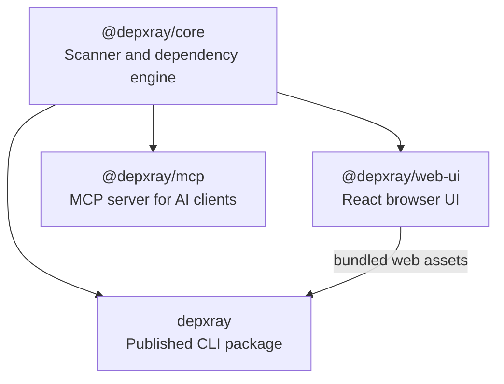

# depxray (Dependency X-Ray)

> Explore JavaScript and TypeScript codebases through an interactive browser graph, machine-readable JSON, and AI-agent-friendly dependency context.

[](https://github.com/Pannawish/depxray)
[](https://opensource.org/licenses/MIT)
[](https://www.npmjs.com/package/depxray)

`depxray` helps developers and AI coding agents understand how a repository is structured and how files depend on each other. It scans a project, builds structure and dependency data, then lets you inspect imports, dependents, circular relationships, orphan files, and file details from a local browser UI, JSON output, or MCP server, with inline source code available in the live browser UI.

## What It Does

- Browse a repo as a compact collapsible file tree
- Explore dependencies in an interactive force-directed graph
- Inspect outgoing imports and incoming dependents for a file
- View file details, folder summaries, and inline source code
- See file health metrics such as LOC, complexity, exports, and instability
- Detect circular dependencies
- Detect orphan files with no incoming imports in dependency mode
- Detect unused exports, including re-exports and barrel files
- Detect unresolved local imports while ignoring external packages and common assets
- Detect unused and unlisted npm dependencies
- Detect workspace ownership and cross-package imports in monorepos
- Validate dependency edges against lightweight architecture rules
- Extend scans and reports with config-driven plugins and hooks
- Diff dependency graph snapshots or compare a git base ref against the working tree
- Export machine-readable JSON for scripts and AI workflows
- Export Mermaid and DOT dependency graphs for docs and PRs
- Expose dependency-analysis tools to AI clients through `@depxray/mcp`
- Generate Markdown project health reports
- Generate a static HTML report in `.depxray/`

## Quick Start

Run directly with `npx`:

```bash
npx depxray scan
```

Scan another project:

```bash
npx depxray scan /path/to/project
```

Start in dependency mode:

```bash
npx depxray scan /path/to/project --mode dependencies
```

Inspect one file:

```bash
npx depxray inspect src/components/Button.tsx --dir /path/to/project
```

Create a reusable project config:

```bash
npx depxray init
```

Generate a Markdown health report:

```bash
npx depxray report /path/to/project --output depxray-report.md
```

Install globally if you prefer:

```bash
npm install -g depxray
depxray scan
```

## Browser UI

The default `scan` command starts a local server and opens a browser UI with three working areas:

- Left: file tree with expand/collapse, search, circular-only filtering, orphan-only filtering, and unused-export filtering
- Center: interactive graph view by default, with a Miller-column dependency tracing view available from the toolbar
- Right: code viewer and file or folder details

Current UI and graph-data capabilities include:

- file tree search by path
- compact rows for large repos
- force-directed graph view for dependency and structure data
- graph zoom, pan, node dragging, click-to-select, and selected-node centering
- graph node labels with Smart, All, and None label visibility modes
- graph node coloring by file extension, circular status, orphan status, unused exports, and unresolved imports
- graph node coloring by workspace in monorepos, with dashed cross-package dependency edges
- directional dependency arrows with circular relationships highlighted
- architecture rule violations highlighted on dependency edges
- file details such as relative path, absolute path, extension, depth, size, incoming count, outgoing count, circular status, and orphan status
- file metrics such as lines of code, cyclomatic complexity, export count, and instability
- unused export lists with line numbers and type-only markers
- unresolved import warnings with import specifiers and line numbers
- folder summaries such as total files, direct children, descendants, internal imports, incoming external references, outgoing external references, circular files, and orphan files inside the folder
- dependency metadata for type-only and dynamic imports in exported graph data
- layout swapping and resizable panels

If the default port `5178` is busy, `depxray` automatically tries the next free local port and prints that change in the terminal.

## CLI Reference

### `scan`

Analyze a project and either open the local browser UI or export data.

```bash
depxray scan [dir] [options]
```

Common options:

- `--json`: print graph JSON to `stdout`
- `-o, --output <file>`: write output to a file; only valid with `--json`
- `--html`: generate a static HTML export in `.depxray/`
- `--mode <mode>`: `structure` or `dependencies`
- `--format <format>`: `json`, `mermaid`, or `dot`; Mermaid/DOT require `--mode dependencies --json`
- `--ignore <patterns...>`: exclude additional paths
- `--no-circular`: skip circular dependency detection in dependency mode
- `--no-aliases`: skip `tsconfig.json` / `jsconfig.json` path alias resolution in dependency mode
- `--orphans`: print orphan files to `stderr` after dependency scanning
- `--unused-exports`: print unused export findings to `stderr` after dependency scanning
- `--unresolved`: print unresolved local imports to `stderr` after dependency scanning
- `--deps`: include unused and unlisted npm dependency analysis in dependency JSON
- `--validate`: validate dependency edges against architecture rules from config
- `--entry-points <patterns...>`: glob patterns to exclude from orphan detection
- `--extensions <exts...>`: choose scanned extensions in dependency mode
- `--depth <depth>`: initial visible depth: any integer `>= 1` or `all`
- `--port <port>`: preferred local dashboard port; falls back to the next free port if needed
- `--watch`: update the browser UI when project files change
- `--no-open`: start the local server without opening a browser

Examples:

```bash
# Open the browser UI on a custom preferred port
npx depxray scan --port 8080

# Exclude generated folders
npx depxray scan --ignore "**/dist/**" "**/coverage/**"

# Export dependency-mode JSON
npx depxray scan /path/to/project --mode dependencies --json --output dep-graph.json

# Export a Mermaid graph for Markdown docs
npx depxray scan /path/to/project --mode dependencies --json --format mermaid --output graph.mmd

# Export Graphviz DOT
npx depxray scan /path/to/project --mode dependencies --json --format dot --output graph.dot

# Print files with no incoming imports
npx depxray scan /path/to/project --mode dependencies --orphans

# Print unused exports
npx depxray scan /path/to/project --mode dependencies --unused-exports

# Print unresolved local imports
npx depxray scan /path/to/project --mode dependencies --unresolved

# Find package.json dependencies that are unused or missing
npx depxray scan /path/to/project --mode dependencies --deps --json

# Fail with exit code 1 when error-level architecture rules are violated
npx depxray scan /path/to/project --mode dependencies --validate

# Treat custom files as entry points instead of orphans
npx depxray scan /path/to/project --mode dependencies --orphans --entry-points "src/routes/**" "src/bootstrap.ts"

# Generate a static HTML report bundle
npx depxray scan /path/to/project --html

# Generate a Markdown project health report
npx depxray report /path/to/project --output depxray-report.md

# Keep the browser UI updated while editing files
npx depxray scan /path/to/project --watch
```

### `inspect`

Inspect what a file imports, what imports it, and any file-level issues such as unused exports or unresolved imports.

```bash
depxray inspect <file> [options]
```

Options:

- `-d, --dir <dir>`: project root directory, default `.`
- `-f, --format <format>`: `text` or `json`, default `text`

Examples:

```bash
npx depxray inspect src/App.tsx --dir /path/to/project
npx depxray inspect src/App.tsx --dir /path/to/project --format json
```

### `report`

Generate a Markdown project health report with summary counts, hub files, heavy importers, orphan files, unused exports, unresolved imports, circular chains, and complexity hotspots.

```bash
depxray report [dir] [options]
```

Options:

- `-o, --output <file>`: write the Markdown report to a file instead of `stdout`
- `--ignore <patterns...>`: exclude additional paths
- `--no-circular`: skip circular dependency detection
- `--no-aliases`: skip `tsconfig.json` / `jsconfig.json` path alias resolution
- `--entry-points <patterns...>`: glob patterns to exclude from orphan detection
- `--extensions <exts...>`: choose scanned extensions

Examples:

```bash
npx depxray report /path/to/project
npx depxray report /path/to/project --output depxray-report.md
```

### `diff`

Compare two dependency graph JSON snapshots, or compare a git base ref against the current working tree.

```bash
depxray diff [before.json] [after.json] [options]
```

Options:

- `--json`: print machine-readable diff JSON
- `--base <ref>`: scan the project at a git ref and compare it with the working tree
- `-d, --dir <dir>`: project directory for `--base`, default `.`

Examples:

```bash
# Create snapshots, then compare them
npx depxray scan /path/to/project --mode dependencies --json --output before.json
npx depxray scan /path/to/project --mode dependencies --json --output after.json
npx depxray diff before.json after.json

# Compare the current working tree against main
npx depxray diff --base main --dir /path/to/project

# Use JSON output in automation
npx depxray diff --base main --json
```

### `init`

Create a `depxray.config.js` file with sensible defaults.

```bash
depxray init [dir] [options]
```

Options:

- `--defaults`: create the default config without prompts
- `--force`: overwrite an existing `depxray.config.js`

Example:

```bash
npx depxray init /path/to/project --defaults
```

## Configuration

`depxray scan` reads persistent project settings from the project root. CLI flags always override config values.

Supported config locations, in order:

1. `depxray.config.js`
2. `depxray.config.mjs`
3. `.depxrayrc.json`
4. `depxray` key in `package.json`

Example `depxray.config.js`:

```js
module.exports = {
  mode: 'dependencies',
  ignore: ['dist', 'coverage'],
  extensions: ['.js', '.jsx', '.ts', '.tsx'],
  entryPoints: ['**/index.*', '**/main.*', '**/App.*'],
  circular: true,
  aliases: true,
  port: 5178,
  depth: 2,
  rules: [
    {
      from: 'src/ui/**',
      to: 'src/db/**',
      severity: 'error',
      message: 'UI cannot import DB modules directly',
    },
  ],
  plugins: [
    '@depxray/plugin-complexity',
    '@depxray/plugin-mcp',
    './depxray-plugin.mjs',
  ],
};
```

Supported fields:

- `ignore`: additional file or directory patterns to ignore
- `extensions`: file extensions included in dependency scans
- `entryPoints`: patterns excluded from orphan-file detection
- `mode`: `structure` or `dependencies`
- `circular`: enable circular dependency detection
- `aliases`: resolve `tsconfig.json` / `jsconfig.json` path aliases
- `port`: preferred browser UI port
- `depth`: initial visible depth, using an integer `>= 1` or `all`
- `rules`: architecture rules for `scan --validate`; matching imports are reported and `error` violations exit with code 1
- `plugins`: plugin module specifiers or inline plugin objects with `afterBuildGraph`, `afterScan`, or `onReport` hooks

Example plugin module:

```js
export function afterScan(result) {
  return {
    ...result,
    pluginData: {
      ...result.pluginData,
      customSummary: { files: result.totalFiles },
    },
  };
}
```

Built-in plugin aliases are resolved by `depxray` itself and do not require installing separate npm packages:

- `@depxray/plugin-complexity`: adds scan-level complexity summary metadata
- `@depxray/plugin-mcp`: adds MCP-oriented tool and scan summary metadata for agent workflows; use `@depxray/mcp` when you need the actual MCP server

## For AI Agents

`depxray` is useful for coding agents that need repository structure and dependency context before making edits.

Use cases:

- generate project-wide structure data with `scan --json`
- generate project-wide dependency data with `scan --mode dependencies --json`
- find dead exports with `scan --mode dependencies --unused-exports --json`
- find broken local references with `scan --mode dependencies --unresolved --json`
- check npm dependency drift with `scan --mode dependencies --deps --json`
- validate architecture boundaries with `scan --mode dependencies --validate`
- compare graph snapshots or review branch dependency changes with `diff`
- inspect one file's outgoing imports and incoming dependents with `inspect --format json`
- create a Markdown health summary with `report --output depxray-report.md`
- save JSON into agent context files or use it in automated review pipelines

Examples:

```bash
npx depxray scan /path/to/project --json > .depxray-context.json
npx depxray scan /path/to/project --mode dependencies --unused-exports --json > .depxray-unused-exports.json
npx depxray scan /path/to/project --mode dependencies --unresolved --json > .depxray-unresolved-imports.json
npx depxray scan /path/to/project --mode dependencies --deps --json > .depxray-deps.json
npx depxray scan /path/to/project --mode dependencies --validate
npx depxray diff --base main --json > .depxray-diff.json
npx depxray inspect src/App.tsx --dir /path/to/project --format json
npx depxray report /path/to/project --output depxray-report.md
```

For MCP-compatible clients, use the dedicated server package:

```bash
npx --package @depxray/mcp depxray-mcp
```

Claude Desktop configuration example:

```json
{
  "mcpServers": {
    "depxray": {
      "command": "npx",
      "args": ["--package", "@depxray/mcp", "depxray-mcp"]
    }
  }
}
```

The MCP server exposes `scan_project`, `inspect_file`, `find_circular`, `find_orphans`, `get_file_tree`, and `get_folder_summary`, with scan and inspect results including unused export and unresolved import metadata.

## How It Works

`depxray` performs static analysis for JavaScript and TypeScript projects using AST-based parsing rather than regex matching.

It supports:

- `.js`, `.jsx`, `.ts`, `.tsx`
- static imports
- named imports
- namespace imports
- type-only imports
- dynamic imports
- CommonJS `require`
- re-exports and barrel files
- `tsconfig.json` and `jsconfig.json` path alias resolution
- `depxray.config.js`, `depxray.config.mjs`, `.depxrayrc.json`, and `package.json` configuration
- circular dependency detection
- orphan file detection with configurable entry point exclusions
- unused export detection with barrel and re-export support
- unresolved local import detection
- unused and unlisted npm dependency detection
- monorepo workspace metadata and cross-package dependency detection
- architecture rule validation with browser-highlighted violating edges
- plugin hooks for extending graph metadata, scan metadata, and report data
- dependency graph diffing for files, edges, and circular dependency changes
- per-file LOC, cyclomatic complexity, export count, and instability metrics
- interactive force-directed dependency and structure graph visualization
- watch mode with live browser UI updates

## Monorepo Layout

This repository is organized into four main workspaces:



- [`packages/core`](./packages/core): scanner and dependency-analysis engine
- [`packages/web-ui`](./packages/web-ui): React browser UI
- [`packages/cli`](./packages/cli): published `depxray` package with the embedded web UI
- [`packages/mcp`](./packages/mcp): MCP stdio server for agentic AI tools

## Local Development

Prerequisites:

- Node.js `>= 18`
- npm

Setup:

```bash
git clone https://github.com/Pannawish/depxray.git
cd depxray
npm install
npm run build
npm test
```

Run the local CLI bundle against a project:

```bash
node packages/cli/dist/index.js scan /path/to/project
```

Useful workspace commands:

```bash
npm run build --workspace @depxray/core
npm run build --workspace @depxray/mcp
npm run build --workspace depxray
```

Develop the browser UI with Vite:

```bash
cd packages/web-ui
npm run dev
```

Then open `http://localhost:5173`.

## License

MIT. See [LICENSE](./LICENSE).
