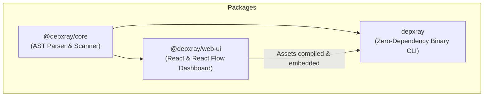

# depxray (Dependency X-Ray)

> A static analyzer and interactive explorer for JavaScript and TypeScript codebases. Map imports, discover circular dependencies, and visualize your code structure from the command line or as a rich interactive dashboard in the browser. Run instantly with `npx depxray scan`.

[](https://github.com/Pannawish/depxray)
[](https://opensource.org/licenses/MIT)
[](https://www.npmjs.com/package/depxray)

---

`depxray` is designed to solve a universal pain point: **understanding complex JavaScript and TypeScript codebases.** Whether you are a human developer onboarding to a massive legacy project, or an AI coding agent (like Claude, Codex, or Antigravity) needing to map relationships to make safe edits, `depxray` provides instant, high-fidelity codebase transparency.

It functions as:
1. **An interactive local dashboard:** High-fidelity web application built with React Flow to explore directories, trace module import graphs, inspect individual file metrics, and view source code side-by-side.
2. **A machine-parseable CLI utility:** Print versioned JSON structures of your codebase directly to `stdout` to pipe into scripts or inject into an LLM's system prompt context.
3. **A zero-dependency standalone HTML bundle:** Package your codebase's entire visualization into a single HTML file you can host on Vercel, Netlify, or share with team members.

---

## Quick Start

You can run `depxray` immediately on any project without installing, using `npx`:

```bash
# Scan the current directory and open the local interactive dashboard
npx depxray scan

# Scan a specific directory
npx depxray scan /path/to/project

# Launch directly in Dependency Graph mode instead of Structure mode
npx depxray scan /path/to/project --mode dependencies
```

Alternatively, install it globally:

```bash
npm install -g depxray
depxray scan
```

---

## Interactive Dashboard Walkthrough

When you run `npx depxray scan`, the embedded local HTTP server spins up and automatically opens a highly responsive, custom-engineered visual interface in your default browser.

```
┌─────────────────────────────────────────────────────────────────────────┐
│  depxray Dashboard                                                      │
├───────────────────────┬─────────────────────────────────────────────────┤
│ [Project Explorer]    │ [Visual Panel]                                  │
│                       │                                                 │
│ 📁 src                │   ● Structure Mode (Nested Columns)             │
│   📁 components       │     OR                                          │
│     📄 Button.tsx     │   ● Dependency Mode (Interactive React Flow)    │
│     📄 Icon.tsx       │                                                 │
├───────────────────────┴─────────────────────────────────────────────────┤
│ [Selection Details]     | [Source Code Viewer with Syntax Highlighting] │
└─────────────────────────────────────────────────────────────────────────┘
```

### 1. Dual Visual Modes
*   **Structure Mode (Nested Tree Explorer):** Displays directories and files as expandable nested columns. It provides inline visibility into file sizing metrics, descendant counts, nesting depth, and folder structures. Perfect for building an initial mental model of physical project layout.
*   **Dependency Mode (Interactive React Flow Graph):** A visual directed-network graph mapping file imports. Nodes represent your files; directed edges represent import statements. You can click files, trace incoming imports (who uses this file?), trace outgoing imports (what does this file use?), and let the layout automatically untangle complex systems.

### 2. Circular Dependency Discovery
Spaghetti dependencies lead to fragile code. `depxray` implements a cycle detection algorithm that:
*   Identifies all cyclic loops (e.g., `A.ts` imports `B.ts` which imports `A.ts`).
*   Lists them clearly in a dedicated sidebar.
*   Highlights affected files and links inside both visual modes.

### 3. Fully Dynamic & Customizable Workspace
The workspace is built for developer productivity, allowing full layout adjustments on the fly:
*   **Horizontal Layout Swapping:** Swap the left panel (Project Explorer) and right panel (Visual graphs) seamlessly using the layout toggles.
*   **Vertical Panel Swapping:** Toggle the placement of the Selection Details and the inline Source Code viewer. Use the header grab-handles (`⋮⋮`) or swap buttons (`⇅`) to move them top-to-bottom.
*   **Fluid Draggable Resizing:** Every column and panel division is bound to high-performance drag-splitters, allowing you to tailor the layout to your display size.
*   **Inline Code Viewer:** Select any node to read its source code instantly in a side-by-side editor panel with built-in syntax highlighting.

---

## How It Works: AST Parsing & Import Resolution

Unlike simplistic regex-based dependency utilities that generate false positives and miss edges, `depxray` uses **Babel AST compiler APIs** to perform robust, syntactically-aware static analysis.

### 1. Parser Specifications
The scanner dynamically assigns Babel parser plugins based on file extensions:
*   **TypeScript (`.ts`, `.tsx`):** Leverages the Babel `typescript` plugin.
*   **JSX (`.jsx`, `.tsx`):** Leverages the Babel `jsx` plugin.
*   **Modern JS/TS syntax:** Pre-configured to support `decorators-legacy`, `dynamicImport`, `classProperties`, `classPrivateProperties`, `classPrivateMethods`, `optionalChaining`, `nullishCoalescingOperator`, `exportDefaultFrom`, and `exportNamespaceFrom`.

### 2. Supported Import/Export Syntax
`depxray` recursively discovers and tracks all the following syntaxes:
*   **Static ESM Imports:** `import React from 'react';`
*   **Named ESM Imports:** `import { Button, Card } from './components';`
*   **Namespace ESM Imports:** `import * as Utils from './utils';`
*   **Type-only Imports:** `import type { UserProps } from './types';`
*   **Static Re-exports:** `export { Button } from './Button';`
*   **Barrel Re-exports:** `export * from './components';`
*   **Dynamic ESM Imports:** `const Module = await import('./heavy-module');`
*   **CommonJS require syntax:** `const fs = require('fs');`

### 3. Path Alias & TSConfig Resolution (`paths`)
Modern codebases rely heavily on path aliases defined in `tsconfig.json` or `jsconfig.json`. `depxray` features a robust configuration compiler that:
1.  **Resolves the `extends` chain:** Recursively traverses and parses inherited parent configuration files, including those located inside external node package dependencies.
2.  **Supports comments & trailing commas:** Safely strips JS comments and trailing commas from `tsconfig.json` before parsing (non-standard JSON supported).
3.  **Applies Wildcards:** Translates patterns like `@/*` and `@components/*` based on `baseUrl` into absolute disk directories.
4.  **Tries Extension Resolution:** Resolves imports missing extensions (e.g. `import Button from './Button'`) by checking extensions in priority order: `.ts` ➔ `.tsx` ➔ `.js` ➔ `.jsx`.
5.  **Tries Directory Index Files:** If an import maps to a directory (e.g., `./utils`), `depxray` automatically searches for directory entry points (e.g., `./utils/index.ts`, `./utils/index.js`).
6.  **Filters External Packages:** Excludes third-party `node_modules` packages from the dependency visual graph to keep visual output clean and performant.

---

## CLI Reference

### 1. `scan` Command
Scans a target directory. By default, it spawns a local HTTP server and launches the interactive dashboard. You can also export the parsed graph directly to JSON or package it into a standalone HTML file.

#### Usage
```bash
depxray scan [dir] [options]
```

#### Arguments
*   `[dir]`: The project directory to scan. Defaults to the current working directory (`.`).

#### Options
| Option | Description |
|:---|:---|
| `--json` | Print the parsed graph JSON directly to standard output (`stdout`). Ideal for AI agent pipelines and custom scripts. |
| `-o, --output <file>` | Write the scan results to a specific file. (Requires `--json` to write JSON or `--html` to write static HTML). |
| `--html` | Generate a standalone, self-contained interactive HTML/JS dashboard bundle in `.depxray/index.html`. |
| `--mode <mode>` | The startup view of the dashboard. Options: `structure` or `dependencies`. (Default: `structure`). |
| `--ignore <patterns...>`| Additional file or directory glob patterns to exclude from analysis (e.g., `**/vendor/**`, `**/*.spec.ts`). |
| `--no-circular` | Deactivate circular dependency parsing to maximize performance on massive codebases. |
| `--no-aliases` | Deactivate standard `tsconfig`/`jsconfig` path alias resolution (e.g. mapping `@/*` paths). |
| `--extensions <exts...>`| File extensions to analyze (Default: `.js`, `.jsx`, `.ts`, `.tsx`). |
| `--depth <depth>` | Default directory expansion depth in Structure mode: `1`, `2`, `3`, `4`, or `all` (Default: `2`). |
| `--port <port>` | The HTTP port for the local dashboard server (Default: `5178`). |
| `--no-open` | Start the local server without automatically opening your browser. |

#### Code Examples
```bash
# 1. Start the interactive server on a custom port without opening a browser
npx depxray scan --port 8080 --no-open

# 2. Exclude mock files and build folder during scan
npx depxray scan --ignore "**/__mocks__/**" "**/build/**"

# 3. Export the entire import dependency graph to a JSON file
npx depxray scan /path/to/project --json --output project-structure.json

# 4. Compile a zero-dependency standalone HTML bundle
npx depxray scan --html --output-path .depxray/report.html
```

---

### 2. `inspect` Command
Inspect import and export relationships for a single file. Highly useful for quick checks in the terminal or supplying targeted context to LLM coding assistants.

#### Usage
```bash
depxray inspect <file> [options]
```

#### Arguments
*   `<file>`: The path to the file to inspect (supports relative and absolute paths).

#### Options
| Option | Description |
|:---|:---|
| `-d, --dir <dir>` | Specify the project root directory (Default: `.`). |
| `-f, --format <format>`| Output format. Options: `text` or `json` (Default: `text`). |

#### Command Output Examples

**1. Human-Readable Text Format (Default):**
```bash
$ npx depxray inspect src/components/Button.tsx

  📄 src/components/Button.tsx
     Extension: .tsx
     Imports:   2 files
     Used by:   2 files

  📥 This file imports:
     → src/components/Icon.tsx { Icon }
     → src/styles/theme.ts (type-only)

  📤 Imported by:
     ← src/components/Form.tsx { Button }
     ← src/pages/Home.tsx { Button }
```

**2. Structured JSON Format (`-f json`):**
```bash
$ npx depxray inspect src/components/Button.tsx -f json
```
```json
{
  "filePath": "src/components/Button.tsx",
  "extension": ".tsx",
  "imports": [
    {
      "resolvedPath": "src/components/Icon.tsx",
      "specifiers": ["Icon"],
      "typeOnly": false
    },
    {
      "resolvedPath": "src/styles/theme.ts",
      "specifiers": [],
      "typeOnly": true
    }
  ],
  "importedBy": [
    {
      "resolvedPath": "src/components/Form.tsx",
      "specifiers": ["Button"]
    },
    {
      "resolvedPath": "src/pages/Home.tsx",
      "specifiers": ["Button"]
    }
  ]
}
```

---

## AI Coding Agent Integration

For AI coding agents (such as Claude, Codex, and Antigravity), reading raw source code files in a massive directory tree can easily overwhelm context windows and result in inaccurate code edits. 

`depxray` provides a perfect semantic overview that agents can query to understand the shape of a project before writing code.

### 🤖 Pipeline Example: Feeding Context to an Agent
You can pipe `depxray`'s structured JSON output directly into your agent's system prompt or workspace context files:

```bash
# Generate project dependency schema
npx depxray scan --json > .depxray-context.json
```

### 📊 Full Graph JSON Output Schema
When running `depxray scan --json`, the generated structure matches the following portable format (all paths resolved as relative to project root):

```json
{
  "version": "1.0.0",
  "metadata": {
    "scannedAt": "2026-05-31T05:10:00.000Z",
    "scanDurationMs": 42.12,
    "projectRoot": "/Users/developer/my-app",
    "totalFiles": 12,
    "totalEdges": 15,
    "circularCount": 1,
    "depxrayVersion": "0.3.0"
  },
  "nodes": [
    {
      "id": "src/components/Button.tsx",
      "relativePath": "src/components/Button.tsx",
      "extension": ".tsx",
      "inDegree": 2,
      "outDegree": 1,
      "isCircular": false,
      "componentName": "Button"
    },
    {
      "id": "src/components/Icon.tsx",
      "relativePath": "src/components/Icon.tsx",
      "extension": ".tsx",
      "inDegree": 1,
      "outDegree": 0,
      "isCircular": false
    }
  ],
  "edges": [
    {
      "source": "src/components/Button.tsx",
      "target": "src/components/Icon.tsx",
      "importSpecifier": "./Icon",
      "importedNames": ["Icon"],
      "isTypeOnly": false,
      "isDynamic": false
    }
  ],
  "circularDependencies": [
    {
      "chain": [
        "src/utils/helperA.ts",
        "src/utils/helperB.ts",
        "src/utils/helperA.ts"
      ],
      "description": "src/utils/helperA.ts → src/utils/helperB.ts → src/utils/helperA.ts"
    }
  ]
}
```

---

## Monorepo Architecture

This project is organized as a high-performance TypeScript monorepo with three core workspaces:



### Monorepo Workspace Details
| Workspace | Package Name | Directory | Role & Description |
|:---|:---|:---|:---|
| **Core Parser** | `@depxray/core` | [`packages/core`](./packages/core) | Core platform-agnostic scanner. Uses TypeScript AST compiler APIs to extract imports, map dependencies, and detect circular loops. |
| **Web Dashboard** | `@depxray/web-ui` | [`packages/web-ui`](./packages/web-ui) | Interactive React dashboard built with React Flow, multiple workspace layouts, and file code visualizer. |
| **Binary CLI** | `depxray` | [`packages/cli`](./packages/cli) | Single-file binary distribution including the fully embedded Web UI. |

### Published Build and Packaging Pipeline
To keep `depxray` exceptionally fast, lightweight, and zero-friction to run via `npx`, the compiler pipeline implements these unique constraints:
*   **Zero Runtime Dependencies:** The published CLI package has **no runtime `node_modules`**. Everything is compiled into a single file `dist/index.js` using `esbuild`. The parser and AST logic are compiled directly into this target bundle.
*   **Embedded Web Assets:** The React dashboard compiled assets (`packages/web-ui/dist/`) are read and injected directly into `packages/cli/dist/web-ui/` during the build process. When the CLI starts a server, it streams the embedded assets directly from the filesystem—no internet connection or external CDN required.
*   **Lightweight and Tree-Shaken:** The total NPM package size is kept extremely lightweight (~1.9 MB including the full interactive dashboard), ensuring that running `npx depxray scan` downloads and launches in seconds.

---

## Local Development & Contributing

### Prerequisite
*   **Node.js >= 18**
*   **npm**

### Setup Environment
1.  **Clone the repository:**
    ```bash
    git clone https://github.com/Pannawish/depxray.git
    cd depxray
    ```
2.  **Install dependencies and link workspaces:**
    ```bash
    npm install
    ```
3.  **Build all workspace projects:**
    ```bash
    npm run build
    ```
4.  **Run tests across all workspaces:**
    ```bash
    npm run test
    ```
5.  **Run the local CLI bundle against a directory:**
    ```bash
    node packages/cli/dist/index.js scan /path/to/project
    ```

### Workspace Development Workflows
Compiling the entire monorepo on every single change can be slow. Use individual workspace compilation to iterate quickly:

#### 1. Developing the Parser or CLI
Compile individual workspaces directly in watch/build modes:
```bash
# Rebuild the core compiler library
npm run build --workspace @depxray/core

# Rebuild the CLI bundle
npm run build --workspace depxray
```

#### 2. Developing the Visual Dashboard (Web UI)
To iterate rapidly on the React dashboard with instant hot-reloading:
```bash
cd packages/web-ui
npm run dev
```
Open [http://localhost:5173](http://localhost:5173) in your browser. This dev server runs with rich Mock/Sample data and connects dynamically to your dev environment.

---

## License
This project is licensed under the MIT License — see the [LICENSE](./LICENSE) file for details. Created by [Pannawish Kriengyakul](https://github.com/Pannawish).
