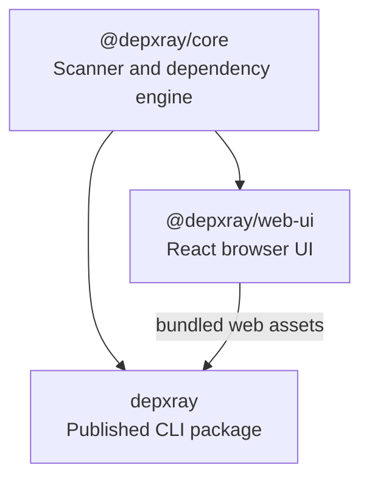

# depxray (Dependency X-Ray)

> Explore JavaScript and TypeScript codebases through an interactive browser graph, machine-readable JSON, and AI-agent-friendly dependency context.

[](https://github.com/Pannawish/depxray)
[](https://opensource.org/licenses/MIT)
[](https://www.npmjs.com/package/depxray)

`depxray` helps developers and AI coding agents understand how a repository is structured and how files depend on each other. It scans a project, builds structure and dependency data, then lets you inspect imports, dependents, circular relationships, orphan files, and file details from a local browser UI or JSON output, with inline source code available in the live browser UI.

## What It Does

- Browse a repo as a compact collapsible file tree
- Explore dependencies in an interactive force-directed graph
- Inspect outgoing imports and incoming dependents for a file
- View file details, folder summaries, and inline source code
- Detect circular dependencies
- Detect orphan files with no incoming imports in dependency mode
- Export machine-readable JSON for scripts and AI workflows
- Generate a static HTML report in `.depxray/`

## Quick Start

Run directly with `npx`:

```bash
npx depxray scan
```

Scan another project:

```bash
npx depxray scan /path/to/project
```

Start in dependency mode:

```bash
npx depxray scan /path/to/project --mode dependencies
```

Inspect one file:

```bash
npx depxray inspect src/components/Button.tsx --dir /path/to/project
```

Install globally if you prefer:

```bash
npm install -g depxray
depxray scan
```

## Browser UI

The default `scan` command starts a local server and opens a browser UI with three working areas:

- Left: file tree with expand/collapse, search, circular-only filtering, and orphan-only filtering
- Center: interactive graph view by default, with a Miller-column dependency tracing view available from the toolbar
- Right: code viewer and file or folder details

Current UI and graph-data capabilities include:

- file tree search by path
- compact rows for large repos
- force-directed graph view for dependency and structure data
- graph zoom, pan, node dragging, click-to-select, and selected-node centering
- graph node labels with Smart, All, and None label visibility modes
- graph node coloring by file extension, circular status, and orphan status
- directional dependency arrows with circular relationships highlighted
- file details such as relative path, absolute path, extension, depth, size, incoming count, outgoing count, circular status, and orphan status
- folder summaries such as total files, direct children, descendants, internal imports, incoming external references, outgoing external references, circular files, and orphan files inside the folder
- dependency metadata for type-only and dynamic imports in exported graph data
- layout swapping and resizable panels

If the default port `5178` is busy, `depxray` automatically tries the next free local port and prints that change in the terminal.

## CLI Reference

### `scan`

Analyze a project and either open the local browser UI or export data.

```bash
depxray scan [dir] [options]
```

Common options:

- `--json`: print graph JSON to `stdout`
- `-o, --output <file>`: write JSON output to a file; only valid with `--json`
- `--html`: generate a static HTML export in `.depxray/`
- `--mode <mode>`: `structure` or `dependencies`
- `--ignore <patterns...>`: exclude additional paths
- `--no-circular`: skip circular dependency detection in dependency mode
- `--no-aliases`: skip `tsconfig.json` / `jsconfig.json` path alias resolution in dependency mode
- `--orphans`: print orphan files to `stderr` after dependency scanning
- `--entry-points <patterns...>`: glob patterns to exclude from orphan detection
- `--extensions <exts...>`: choose scanned extensions in dependency mode
- `--depth <depth>`: initial visible depth: any integer `>= 1` or `all`
- `--port <port>`: preferred local dashboard port; falls back to the next free port if needed
- `--no-open`: start the local server without opening a browser

Examples:

```bash
# Open the browser UI on a custom preferred port
npx depxray scan --port 8080

# Exclude generated folders
npx depxray scan --ignore "**/dist/**" "**/coverage/**"

# Export dependency-mode JSON
npx depxray scan /path/to/project --mode dependencies --json --output dep-graph.json

# Print files with no incoming imports
npx depxray scan /path/to/project --mode dependencies --orphans

# Treat custom files as entry points instead of orphans
npx depxray scan /path/to/project --mode dependencies --orphans --entry-points "src/routes/**" "src/bootstrap.ts"

# Generate a static HTML report bundle
npx depxray scan /path/to/project --html
```

### `inspect`

Inspect what a file imports and what imports it.

```bash
depxray inspect <file> [options]
```

Options:

- `-d, --dir <dir>`: project root directory, default `.`
- `-f, --format <format>`: `text` or `json`, default `text`

Examples:

```bash
npx depxray inspect src/App.tsx --dir /path/to/project
npx depxray inspect src/App.tsx --dir /path/to/project --format json
```

## For AI Agents

`depxray` is useful for coding agents that need repository structure and dependency context before making edits.

Use cases:

- generate project-wide structure data with `scan --json`
- generate project-wide dependency data with `scan --mode dependencies --json`
- inspect one file's outgoing imports and incoming dependents with `inspect --format json`
- save JSON into agent context files or use it in automated review pipelines

Examples:

```bash
npx depxray scan /path/to/project --json > .depxray-context.json
npx depxray inspect src/App.tsx --dir /path/to/project --format json
```

## How It Works

`depxray` performs static analysis for JavaScript and TypeScript projects using AST-based parsing rather than regex matching.

It supports:

- `.js`, `.jsx`, `.ts`, `.tsx`
- static imports
- named imports
- namespace imports
- type-only imports
- dynamic imports
- CommonJS `require`
- re-exports and barrel files
- `tsconfig.json` and `jsconfig.json` path alias resolution
- circular dependency detection
- orphan file detection with configurable entry point exclusions
- interactive force-directed dependency and structure graph visualization

## Monorepo Layout

This repository is organized into three main workspaces:



- [`packages/core`](./packages/core): scanner and dependency-analysis engine
- [`packages/web-ui`](./packages/web-ui): React browser UI
- [`packages/cli`](./packages/cli): published `depxray` package with the embedded web UI

## Local Development

Prerequisites:

- Node.js `>= 18`
- npm

Setup:

```bash
git clone https://github.com/Pannawish/depxray.git
cd depxray
npm install
npm run build
npm test
```

Run the local CLI bundle against a project:

```bash
node packages/cli/dist/index.js scan /path/to/project
```

Useful workspace commands:

```bash
npm run build --workspace @depxray/core
npm run build --workspace depxray
```

Develop the browser UI with Vite:

```bash
cd packages/web-ui
npm run dev
```

Then open `http://localhost:5173`.

## License

MIT. See [LICENSE](./LICENSE).
