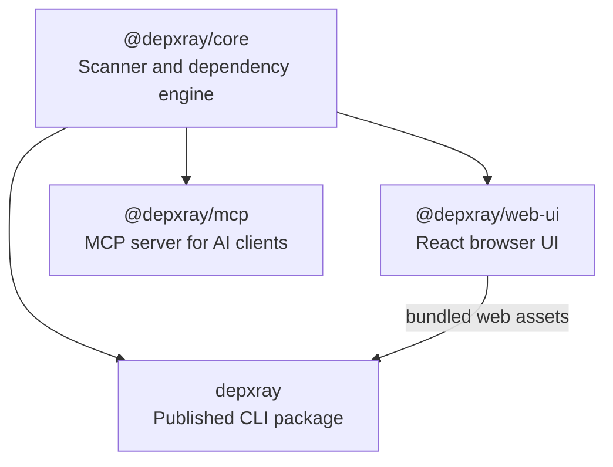

# depxray (Dependency X-Ray)

> Explore JavaScript and TypeScript codebases through an interactive browser graph, health dashboard, machine-readable JSON, and AI-agent-friendly dependency context.

[](https://github.com/Pannawish/depxray)
[](https://opensource.org/licenses/MIT)
[](https://www.npmjs.com/package/depxray)

`depxray` helps developers and AI coding agents understand how a repository is structured, how files depend on each other, and where refactor risk is concentrated. It scans a project, builds structure, dependency, health, and cleanup data, then lets you inspect imports, dependents, circular relationships, orphan files, cleanup findings, health scores, and file details from a local browser UI, JSON output, or MCP server, with inline source code available in the live browser UI.

## What It Does

- Browse a repo as a compact collapsible file tree
- Explore dependencies in an interactive graph with focused layouts and drill-down scopes
- Review a codebase health dashboard with an explainable A-F score, issue counts, complexity hotspots, and dependency hubs
- Color graph nodes by extension, complexity, file size, or instability
- Inspect outgoing imports and incoming dependents for a file
- Analyze a file's dependency impact and refactor blast radius
- View file details, folder summaries, and inline source code
- See file health metrics such as LOC, complexity, exports, and instability
- Detect circular dependencies
- Detect orphan files with no incoming imports in dependency mode
- Detect unused exports, including re-exports and barrel files
- Detect unresolved local imports while ignoring external packages and common assets
- Apply safe autofixes with dry-run and confirmation controls
- Detect devDependencies used from production entry point trees
- Detect unused and unlisted npm dependencies
- Detect workspace ownership and cross-package imports in monorepos
- Validate dependency edges against lightweight architecture rules
- Enforce entry-point-scoped restricted imports
- Enforce and autofix internal import conventions
- Resolve modern workspace package `exports` and `imports` maps
- Run CI checks with non-zero exit codes
- Export SARIF for code scanning integrations
- Explore entry points and transitive import trees from the CLI
- Extend scans and reports with config-driven plugins and hooks
- Diff dependency graph snapshots or compare a git base ref against the working tree
- Export machine-readable JSON for scripts and AI workflows
- Export Mermaid and DOT dependency graphs for docs and PRs
- Expose dependency-analysis tools to AI clients through `@depxray/mcp`
- Give MCP agents health checks, dependency-chain explanations, related-file lookup, cleanup suggestions, and graph diffs
- Generate dependency-diff Markdown for PR review with the built-in GitHub PR plugin
- Generate Markdown project health reports
- Generate a static HTML report in `.depxray/`

## Quick Start

Run directly with `npx`:

```bash
npx depxray scan
```

Scan another project:

```bash
npx depxray scan /path/to/project
```

Start in dependency mode:

```bash
npx depxray scan /path/to/project --mode dependencies
```

Inspect one file:

```bash
npx depxray inspect src/components/Button.tsx --dir /path/to/project
```

Analyze the files that would be affected by changing one file:

```bash
npx depxray impact src/components/Button.tsx /path/to/project
```

Create a reusable project config:

```bash
npx depxray init
```

Generate a Markdown health report:

```bash
npx depxray report /path/to/project --output depxray-report.md
```

Install globally if you prefer:

```bash
npm install -g depxray
depxray scan
```

## Browser UI

The default `scan` command starts a local server and opens a browser UI with three working areas:

- Left: file tree with expand/collapse, search, circular-only filtering, orphan-only filtering, and unused-export filtering
- Center: interactive graph view by default, with Miller-column dependency tracing and Health Dashboard views available from the prominent Center view switch
- Right: code viewer and file or folder details

Current UI and graph-data capabilities include:

- file tree search by path
- compact rows for large repos
- interactive graph view for dependency and structure data
- graph zoom, pan, click-to-select, stable deterministic layouts, and selected-node centering
- context-aware Project, Folder, and File neighborhood graph scopes with breadcrumbs
- quick graph presets for overview, direct relationships, full neighborhoods, circular dependencies, architecture violations, and high-impact files
- direct, two-level, and complete file dependency neighborhoods
- three-column file layouts for dependents, the selected file, and dependencies
- folder boundary views for internal, incoming, outgoing, or all dependencies
- top-level project and folder clusters with aggregated dependency counts
- an 80-node initial rendering budget with drillable folder grouping for larger scopes
- shortest dependency-path highlighting and right-click graph actions
- selected-file impact highlighting, showing dependents and dependency paths in the force graph
- semantic graph labels that prioritize folders, selected files, and hubs while becoming smaller on close zoom; Smart, All, and None modes remain available
- hover and selection focus that fades unrelated nodes and edges, with directional arrows reserved for emphasized relationships
- type-only and dynamic dependency edges hidden by default and available as optional toggles
- graph node coloring by file extension, circular status, orphan status, unused exports, and unresolved imports
- graph heatmap coloring by complexity, file size, and instability
- graph node coloring by workspace in monorepos, with dashed cross-package dependency edges
- directional dependency arrows with circular relationships highlighted
- architecture rule violations highlighted on dependency edges
- file details such as relative path, absolute path, extension, depth, size, incoming count, outgoing count, circular status, and orphan status
- file metrics such as lines of code, cyclomatic complexity, export count, and instability
- file impact details such as direct dependents, transitive dependents, max impact depth, and high-impact/high-complexity risk
- unused export lists with line numbers and type-only markers
- unresolved import warnings with import specifiers and line numbers
- folder summaries such as total files, direct children, descendants, internal imports, incoming external references, outgoing external references, circular files, and orphan files inside the folder
- dependency metadata for type-only and dynamic imports in exported graph data
- layout swapping and resizable panels
- health dashboard with score, grade, issue summary, complexity hotspots, dependency hubs, and an information button that shows the exact calculation

The health score starts at 100 and subtracts capped deductions for circular chains, orphan files, unused exports, unresolved local imports, error-level architecture violations, and elevated average complexity. The information panel shows the observed values, deduction rules, points lost, and A-F thresholds for the current scan. The final score is rounded and clamped between 0 and 100.

If the default port `5178` is busy, `depxray` automatically tries the next free local port and prints that change in the terminal.

## CLI Reference

### `scan`

Analyze a project and either open the local browser UI or export data.

```bash
depxray scan [dir] [options]
```

Common options:

- `--json`: print graph JSON to `stdout`
- `-o, --output <file>`: write output to a file; only valid with `--json`
- `--html`: generate a static HTML export in `.depxray/`
- `--mode <mode>`: `structure` or `dependencies`
- `--format <format>`: `json`, `mermaid`, or `dot`; Mermaid/DOT require `--mode dependencies --json`
- `--format sarif`: export dependency findings as SARIF; requires `--mode dependencies --json`
- `--ignore <patterns...>`: exclude additional paths
- `--no-circular`: skip circular dependency detection in dependency mode
- `--no-aliases`: skip `tsconfig.json` / `jsconfig.json` path alias resolution in dependency mode
- `--orphans`: print orphan files to `stderr` after dependency scanning
- `--unused-exports`: print unused export findings to `stderr` after dependency scanning
- `--unresolved`: print unresolved local imports to `stderr` after dependency scanning
- `--deps`: include unused and unlisted npm dependency analysis in dependency JSON
- `--validate`: validate dependency edges against architecture rules from config
- `--fix`: apply safe autofixes for unused exports, orphan files, configured import conventions, and unused npm dependencies when combined with `--deps`
- `--dry-run`: show autofix actions without modifying files
- `--yes`: apply autofixes without prompting
- `--prod-entry-points <patterns...>`: production entry points for devDependency checks
- `--dev-entry-points <patterns...>`: development-only entry points for devDependency checks
- `--ignore-type-imports`: ignore type-only imports for devDependency checks
- `--entry-points <patterns...>`: glob patterns to exclude from orphan detection
- `--extensions <exts...>`: choose scanned extensions in dependency mode
- `--depth <depth>`: initial visible depth: any integer `>= 1` or `all`
- `--port <port>`: preferred local dashboard port; falls back to the next free port if needed
- `--watch`: update the browser UI when project files change
- `--no-open`: start the local server without opening a browser

Examples:

```bash
# Open the browser UI on a custom preferred port
npx depxray scan --port 8080

# Exclude generated folders
npx depxray scan --ignore "**/dist/**" "**/coverage/**"

# Export dependency-mode JSON
npx depxray scan /path/to/project --mode dependencies --json --output dep-graph.json

# Export a Mermaid graph for Markdown docs
npx depxray scan /path/to/project --mode dependencies --json --format mermaid --output graph.mmd

# Export Graphviz DOT
npx depxray scan /path/to/project --mode dependencies --json --format dot --output graph.dot

# Export SARIF for code scanning
npx depxray scan /path/to/project --mode dependencies --json --format sarif --output depxray.sarif

# Print files with no incoming imports
npx depxray scan /path/to/project --mode dependencies --orphans

# Print unused exports
npx depxray scan /path/to/project --mode dependencies --unused-exports

# Print unresolved local imports
npx depxray scan /path/to/project --mode dependencies --unresolved

# Preview safe autofixes
npx depxray scan /path/to/project --fix --dry-run

# Preview unused npm dependency removals
npx depxray scan /path/to/project --fix --deps --dry-run

# Apply safe autofixes without a prompt
npx depxray scan /path/to/project --fix --yes

# Find package.json dependencies that are unused or missing
npx depxray scan /path/to/project --mode dependencies --deps --json

# Fail with exit code 1 when error-level architecture rules are violated
npx depxray scan /path/to/project --mode dependencies --validate

# Run all CI checks with exit code 1 on findings
npx depxray check /path/to/project

# Treat custom files as entry points instead of orphans
npx depxray scan /path/to/project --mode dependencies --orphans --entry-points "src/routes/**" "src/bootstrap.ts"

# Generate a static HTML report bundle
npx depxray scan /path/to/project --html

# Generate a Markdown project health report
npx depxray report /path/to/project --output depxray-report.md

# Keep the browser UI updated while editing files
npx depxray scan /path/to/project --watch
```

### `inspect`

Inspect what a file imports, what imports it, and any file-level issues such as unused exports or unresolved imports.

```bash
depxray inspect <file> [options]
```

Options:

- `-d, --dir <dir>`: project root directory, default `.`
- `-f, --format <format>`: `text` or `json`, default `text`

Examples:

```bash
npx depxray inspect src/App.tsx --dir /path/to/project
npx depxray inspect src/App.tsx --dir /path/to/project --format json
```

### `impact`

Analyze which files directly or transitively depend on a target file. This helps developers and AI coding agents estimate change risk before refactors.

```bash
depxray impact <file> [dir] [options]
```

Options:

- `--json`: print machine-readable JSON
- `--format <format>`: `text` or `json`, default `text`
- `--complexity-threshold <number>`: complexity score considered high
- `--impact-threshold <number>`: transitive dependent count considered high-impact
- `--inbound-threshold <number>`: incoming import count considered high-impact
- `--ignore <patterns...>`: exclude additional paths
- `--no-circular`: skip circular dependency detection
- `--no-aliases`: skip `tsconfig.json` / `jsconfig.json` path alias resolution
- `--extensions <exts...>`: choose scanned extensions

Examples:

```bash
npx depxray impact src/utils/format.ts /path/to/project
npx depxray impact src/utils/format.ts /path/to/project --json
```

### `report`

Generate a Markdown project health report with summary counts, hub files, heavy importers, orphan files, unused exports, unresolved imports, circular chains, complexity hotspots, devDependencies used in production, and import-convention violations.

```bash
depxray report [dir] [options]
```

Options:

- `-o, --output <file>`: write the Markdown report to a file instead of `stdout`
- `--ignore <patterns...>`: exclude additional paths
- `--no-circular`: skip circular dependency detection
- `--no-aliases`: skip `tsconfig.json` / `jsconfig.json` path alias resolution
- `--entry-points <patterns...>`: glob patterns to exclude from orphan detection
- `--extensions <exts...>`: choose scanned extensions

Examples:

```bash
npx depxray report /path/to/project
npx depxray report /path/to/project --output depxray-report.md
```

### `check`

Run dependency health checks for CI. `check` exits with code `1` when it finds circular dependencies, orphan files, unused exports, unresolved imports, error-level architecture violations, devDependencies in production paths, or configured import convention violations.

```bash
depxray check [dir] [options]
```

Options:

- `--format <format>`: `text` or `json`
- `--json`: print machine-readable JSON
- `--base <ref>`: compare with a Git ref and fail only for newly introduced findings
- `--max-health-drop <points>`: fail when the health score drops more than the allowed amount; requires `--base`
- `--ignore <patterns...>`: exclude additional paths
- `--extensions <exts...>`: choose scanned extensions
- `--entry-points <patterns...>`: entry point patterns to exclude from orphan detection
- `--prod-entry-points <patterns...>`: production entry points for devDependency checks
- `--dev-entry-points <patterns...>`: development-only entry points for devDependency checks
- `--ignore-type-imports`: ignore type-only imports for devDependency checks
- `--no-circular`: skip circular dependency detection
- `--no-aliases`: skip `tsconfig.json` / `jsconfig.json` path alias resolution

Examples:

```bash
npx depxray check /path/to/project
npx depxray check /path/to/project --json
npx depxray check /path/to/project --base origin/main --max-health-drop 3
```

Without `--base`, all findings fail the check. With `--base`, existing findings remain visible in the output, but only new findings (or an excessive configured health-score drop) fail CI.

### `entry-points`, `trace`, and `tree`

Explore dependency reachability from the terminal.

```bash
depxray entry-points [dir] [options]
depxray trace <file> [dir] [options]
depxray tree <entry-point> [dir] [options]
```

Examples:

```bash
npx depxray entry-points /path/to/project
npx depxray trace src/utils/math.ts /path/to/project
npx depxray tree src/main.ts /path/to/project --json
```

### `diff`

Compare two dependency graph JSON snapshots, or compare a git base ref against the current working tree.

```bash
depxray diff [before.json] [after.json] [options]
```

Options:

- `--json`: print machine-readable diff JSON
- `--base <ref>`: scan the project at a git ref and compare it with the working tree
- `-d, --dir <dir>`: project directory for `--base`, default `.`

Examples:

```bash
# Create snapshots, then compare them
npx depxray scan /path/to/project --mode dependencies --json --output before.json
npx depxray scan /path/to/project --mode dependencies --json --output after.json
npx depxray diff before.json after.json

# Compare the current working tree against main
npx depxray diff --base main --dir /path/to/project

# Use JSON output in automation
npx depxray diff --base main --json
```

### `init`

Create a `depxray.config.js` file with sensible defaults.

```bash
depxray init [dir] [options]
```

Options:

- `--defaults`: create the default config without prompts
- `--force`: overwrite an existing `depxray.config.js`

Example:

```bash
npx depxray init /path/to/project --defaults
```

## Configuration

`depxray scan` reads persistent project settings from the project root. CLI flags always override config values.

Supported config locations, in order:

1. `depxray.config.js`
2. `depxray.config.mjs`
3. `.depxrayrc.json`
4. `depxray` key in `package.json`

Example `depxray.config.js`:

```js
module.exports = {
  mode: 'dependencies',
  ignore: ['dist', 'coverage'],
  extensions: ['.js', '.jsx', '.ts', '.tsx'],
  entryPoints: ['**/index.*', '**/main.*', '**/App.*'],
  circular: true,
  aliases: true,
  port: 5178,
  depth: 2,
  rules: [
    {
      from: 'src/ui/**',
      to: 'src/db/**',
      severity: 'error',
      message: 'UI cannot import DB modules directly',
    },
    {
      entryPoints: ['src/server.ts'],
      deny: { files: ['src/components/**'], modules: ['react'] },
      severity: 'error',
      message: 'Server entry cannot import browser UI code',
    },
  ],
  prodEntryPoints: ['src/main.tsx', 'src/server.ts'],
  devEntryPoints: ['**/*.test.*', 'scripts/**'],
  ignoreTypeImports: true,
  importConventions: {
    prefer: 'absolute',
    aliasPrefix: '@/',
    root: 'src',
  },
  plugins: [
    '@depxray/plugin-complexity',
    '@depxray/plugin-mcp',
    '@depxray/plugin-github-pr',
    './depxray-plugin.mjs',
  ],
};
```

Supported fields:

- `ignore`: additional file or directory patterns to ignore
- `extensions`: file extensions included in dependency scans
- `entryPoints`: patterns excluded from orphan-file detection
- `mode`: `structure` or `dependencies`
- `circular`: enable circular dependency detection
- `aliases`: resolve `tsconfig.json` / `jsconfig.json` path aliases
- `port`: preferred browser UI port
- `depth`: initial visible depth, using an integer `>= 1` or `all`
- `rules`: architecture rules for `scan --validate`; matching imports are reported and `error` violations exit with code 1
- `prodEntryPoints`: production entry point patterns for devDependency checks
- `devEntryPoints`: development entry point patterns excluded from production checks
- `ignoreTypeImports`: ignores type-only imports when checking devDependency usage
- `importConventions`: internal import style enforcement; `scan --fix` can rewrite safe violations
- `plugins`: plugin module specifiers or inline plugin objects with `afterBuildGraph`, `afterScan`, or `onReport` hooks

When `entryPoints` is omitted, depxray also recognizes package-declared entry files and common Next.js, Remix, SvelteKit, Astro, Gatsby, Nuxt, and Storybook conventions. Explicit `entryPoints` continue to override automatic detection.

Example plugin module:

```js
export function afterScan(result) {
  return {
    ...result,
    pluginData: {
      ...result.pluginData,
      customSummary: { files: result.totalFiles },
    },
  };
}
```

Built-in plugin aliases are resolved by `depxray` itself and do not require installing separate npm packages:

- `@depxray/plugin-complexity`: adds scan-level complexity summary metadata
- `@depxray/plugin-mcp`: adds MCP-oriented tool and scan summary metadata for agent workflows; use `@depxray/mcp` when you need the actual MCP server
- `@depxray/plugin-github-pr`: formats dependency graph diffs as Markdown suitable for GitHub PR comments

## For AI Agents

`depxray` is useful for coding agents that need repository structure and dependency context before making edits.

Use cases:

- generate project-wide structure data with `scan --json`
- generate project-wide dependency data with `scan --mode dependencies --json`
- find dead exports with `scan --mode dependencies --unused-exports --json`
- find broken local references with `scan --mode dependencies --unresolved --json`
- check npm dependency drift with `scan --mode dependencies --deps --json`
- check devDependency runtime risk with `prodEntryPoints` and `scan --mode dependencies --json`
- analyze refactor blast radius with `impact --json`
- validate architecture boundaries with `scan --mode dependencies --validate`
- run all configured CI gates with `check --json`
- export SARIF with `scan --mode dependencies --json --format sarif`
- trace reachability with `entry-points`, `trace`, and `tree`
- compare graph snapshots or review branch dependency changes with `diff`
- ask MCP agents for `check_health`, `explain_dependency_chain`, `find_related_files`, `suggest_cleanup`, and `diff_graphs`
- inspect one file's outgoing imports and incoming dependents with `inspect --format json`
- create a Markdown health summary with `report --output depxray-report.md`
- save JSON into agent context files or use it in automated review pipelines

Examples:

```bash
npx depxray scan /path/to/project --json > .depxray-context.json
npx depxray scan /path/to/project --mode dependencies --unused-exports --json > .depxray-unused-exports.json
npx depxray scan /path/to/project --mode dependencies --unresolved --json > .depxray-unresolved-imports.json
npx depxray scan /path/to/project --mode dependencies --deps --json > .depxray-deps.json
npx depxray scan /path/to/project --mode dependencies --validate
npx depxray check /path/to/project --json > .depxray-check.json
npx depxray scan /path/to/project --mode dependencies --json --format sarif > depxray.sarif
npx depxray impact src/App.tsx /path/to/project --json > .depxray-impact.json
npx depxray diff --base main --json > .depxray-diff.json
npx depxray inspect src/App.tsx --dir /path/to/project --format json
npx depxray report /path/to/project --output depxray-report.md
```

For MCP-compatible clients, use the dedicated server package:

```bash
npx --package @depxray/mcp depxray-mcp
```

Claude Desktop configuration example:

```json
{
  "mcpServers": {
    "depxray": {
      "command": "npx",
      "args": ["--package", "@depxray/mcp", "depxray-mcp"]
    }
  }
}
```

The MCP server exposes `scan_project`, `inspect_file`, `analyze_impact`, `check_health`, `find_unused_exports`, `explain_dependency_chain`, `find_related_files`, `suggest_cleanup`, `diff_graphs`, `find_circular`, `find_orphans`, `get_file_tree`, and `get_folder_summary`, with tool results including dependency risk, health scoring, cleanup findings, unused exports, unresolved imports, and graph-diff metadata.

## How It Works

`depxray` performs static analysis for JavaScript and TypeScript projects using AST-based parsing rather than regex matching.

It supports:

- `.js`, `.jsx`, `.ts`, `.tsx`
- static imports
- named imports
- namespace imports
- type-only imports
- dynamic imports
- CommonJS `require`
- re-exports and barrel files
- `tsconfig.json` and `jsconfig.json` path alias resolution
- `depxray.config.js`, `depxray.config.mjs`, `.depxrayrc.json`, and `package.json` configuration
- circular dependency detection
- orphan file detection with configurable entry point exclusions
- unused export detection with barrel and re-export support
- unresolved local import detection
- dependency impact analysis for direct and transitive dependents
- autofix dry-runs and safe source rewrites
- unused and unlisted npm dependency detection
- devDependency usage detection from production entry point trees
- monorepo workspace metadata and cross-package dependency detection
- package.json `exports` and `imports` map resolution for workspaces
- architecture rule validation with browser-highlighted violating edges
- entry-point-scoped restricted import rules
- import convention detection and autofix suggestions
- plugin hooks for extending graph metadata, scan metadata, and report data
- built-in GitHub PR report formatting for dependency graph diffs
- dependency graph diffing for files, edges, and circular dependency changes
- SARIF export for CI/code scanning
- CI check command with non-zero exit codes
- entry-point, trace, and transitive tree analysis commands
- dependency impact and refactor blast-radius analysis
- per-file LOC, cyclomatic complexity, export count, and instability metrics
- project health scoring with complexity hotspots and dependency hubs
- interactive dependency and structure graph visualization with deterministic scoped layouts, presets, semantic labels, and folder aggregation
- browser health dashboard and graph heatmap overlays
- watch mode with live browser UI updates

## Monorepo Layout

This repository is organized into four npm workspaces:



- [`packages/core`](./packages/core): scanner and dependency-analysis engine
- [`packages/web-ui`](./packages/web-ui): React browser UI
- [`packages/cli`](./packages/cli): published `depxray` package with the embedded web UI
- [`packages/mcp`](./packages/mcp): MCP stdio server for agentic AI tools

## Local Development

Prerequisites:

- Node.js `>= 18`
- npm

Setup:

```bash
git clone https://github.com/Pannawish/depxray.git
cd depxray
npm install
npm run build
npm test
```

Run the local CLI bundle against a project:

```bash
node packages/cli/dist/index.js scan /path/to/project
```

Useful workspace commands:

```bash
npm run build --workspace @depxray/core
npm run build --workspace @depxray/mcp
npm run build --workspace depxray
```

Repository quality and self-analysis commands:

```bash
npm run verify
npm run analyze:self
npm run test:e2e --workspace @depxray/web-ui
```

See [docs/maintainability.md](./docs/maintainability.md) for module boundaries and contribution
guidance.

Develop the browser UI with Vite:

```bash
cd packages/web-ui
npm run dev
```

Then open `http://localhost:5173`.

## License

MIT. See [LICENSE](./LICENSE).
